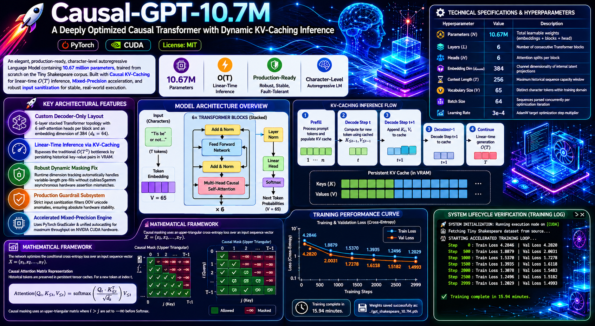

# Causal-GPT-10.7M: A Deeply Optimized Causal Transformer with Dynamic KV-Caching Inference

<p align="center">
  
</p>

[](https://pytorch.org/)
[](https://developer.nvidia.com/cuda-toolkit)
[](https://opensource.org/licenses/MIT)

An elegant, production-ready, character-level autoregressive Language Model containing **10.67 million parameters**, trained completely from scratch on the Tiny Shakespeare corpus. This repository showcases advanced PyTorch systems engineering, featuring **Causal Key-Value (KV) Caching** for linear-time inference ($O(T)$), automated Mixed-Precision (`torch.amp`) acceleration, and a robust, fault-tolerant interactive runtime shell with strict out-of-vocabulary input sanitization.

---

## 🚀 Key Architectural Features

* **Custom Decoder-Only Layout:** Built upon a 6-layer stacked Transformer topology with 6 self-attention heads per block and an embedding dimension of 384 ($d_k = 64$).
* **Linear-Time Inference via KV-Caching:** Bypasses the traditional $O(T^2)$ computational bottleneck during autoregressive generation by persisting historical context key-value pairs directly in VRAM.
* **Robust Dynamic Masking Fix:** Engineered with runtime dimension tracking to automatically handle variable-length token pre-fills without triggering `cublasSgemm` asynchronous hardware assertion mismatches.
* **Production Guardrail Subsystem:** Implements strict input sanitization boundaries that filter out-of-vocabulary (OOV) unicode anomalies, ensuring absolute hardware stability on live execution nodes.
* **Accelerated Mixed-Precision Engine:** Utilizes PyTorch `GradScaler` and unified autocasting configurations to achieve optimized floating-point throughput on modern NVIDIA CUDA hardware templates.

---

## 📊 Technical Specifications & Hyperparameters

| Hyperparameter | Value | Description |
| :--- | :--- | :--- |
| **Parameters ($N$)** | `10.67M` | Total learnable weights (embeddings + blocks + head) |
| **Layers ($L$)** | `6` | Number of consecutive Transformer blocks |
| **Heads ($H$)** | `6` | Attention splits per block |
| **Embedding Dim ($d_{model}$)** | `384` | Channel dimensionality of internal latent projections |
| **Context Length ($T$)** | `256` | Maximum historical sequence capacity window |
| **Vocabulary Size ($V$)** | `65` | Distinct character tokens within training domain |
| **Batch Size** | `64` | Sequences parsed concurrently per optimization iteration |
| **Learning Rate** | `3e-4` | AdamW target optimization step multiplier |

---

## 📈 Mathematical Framework

The network optimizes the conditional cross-entropy loss over an input sequence vector $X = (x_1, x_2, \dots, x_T)$. 

### Causal Attention Matrix Representation
During evaluation loops, historical token spaces are preserved within persistent tensor caches. For a newly incoming token vector at index $t$, the Query, Key, and Value vectors interact exclusively over the concatenated historical coordinate spectrum:

$$\text{Attention}(Q_{t}, K_{\leq t}, V_{\leq t}) = \text{softmax}\left(\frac{Q_{t} \cdot K_{\leq t}^T}{\sqrt{d_k}}\right)V_{\leq t}$$

The spatial causal context restriction uses an upper-triangular masking function where indices $i > j$ are down-scaled to float negative infinity ($-\infty$) prior to applying the Softmax normalization layer.

---

## ⚙️ Project Lifecycle Verification

### 1. Training Performance Curve
The system exhibits stable, monotonic convergence, scaling down Cross-Entropy limits cleanly across targeted epochs:

```text
🚀 SYSTEM INITIALIZATION: Running execution node on [CUDA]
📥 Fetching Tiny Shakespeare dataset from source...

🏋️ STARTING ACCELERATED TRAINING LOOP...
   Step    0: Train Loss 4.2846 | Val Loss 4.2820
   Step  500: Train Loss 1.8879 | Val Loss 2.0031
   Step 1000: Train Loss 1.5370 | Val Loss 1.7278
   Step 1500: Train Loss 1.3935 | Val Loss 1.6118
   Step 2000: Train Loss 1.3078 | Val Loss 1.5483
   Step 2500: Train Loss 1.2496 | Val Loss 1.5182
   Step 2999: Train Loss 1.2029 | Val Loss 1.4993
✓ Training complete in 15.94 minutes.
💾 Weights saved successfully to local directory as: ./gpt_shakespeare_10.7M.pth
